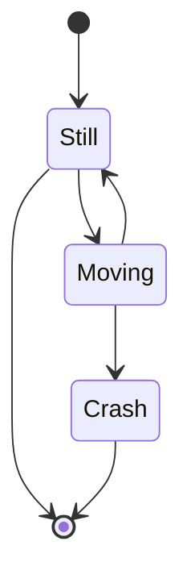

# 💰 PayStream

A modern, full-stack **PayStream** built with **Django + React**. Designed for small businesses and freelancers to manage clients, invoices, payments, and uploaded PDFs—securely, intuitively, and efficiently.

---

## 🧾 Project Idea: PayStream

**PayStream** is a application for managing:

- ✅ Clients: Add, edit, delete, search clients.
- 🧾 Invoices: Create, update, delete invoices; associate them with clients.
- 📄 PDF Uploads: Upload & preview invoice files (e.g., PDF receipts).
- 📦 Storage: Store uploaded documents locally or on AWS S3 with signed URLs.
- 🔐 Access Control: Restrict download/view access based on user roles.
- 🧠 Audit Logs: Log PDF views/downloads for traceability.
- 🔍 Filters, Pagination, Search: Built-in support for all listings.
- 🔔 Polished UI: Confirmation modals, toasts, loading states, validations.
- 📈 Dashboard Ready: Designed to expand to analytics, charts, notifications.

---

## ⚙️ Tech Stack

| Layer       | Technology                                  |
|-------------|---------------------------------------------|
| Backend     | Django, Django REST Framework, Celery, Redis, PostgreSQL |
| Frontend    | React, Tailwind CSS, react-router-dom, Axios, react-dropzone, react-pdf |
| Task Queue  | Celery + Redis                              |
| Storage     | Local (dev) / AWS S3 (prod)                 |
| Auth        | Django Sessions / JWT (extensible)          |
| DevOps      | Docker, Docker Compose, Nginx               |
| Testing     | Django tests, Cypress, Jest (coming soon)   |

---

## 🏗️ Architecture Overview

Diagrams:
- [📊 Architecture Diagram](docs/diagrams/architecture.md)
- [📊 Architecture Diagram](docs/diagrams/ArchitectureDiagram.svg)
- [🖥️ UI Page Navigation Flow](docs/diagrams/ui-flow-diagram.md)
- [🧩 Backend Component Map](docs/diagrams/backend-component-map.md)
- [🧩 Frontend Component Map](docs/diagrams/frontend-component-map.md)
- [🌲 Component Tree View](docs/diagrams/component-tree.md)

---




## 📐 Models

### Client
- `name`, `email`, `company`, `phone`, `created_at`, `updated_at`

### Invoice
- `client`, `amount`, `due_date`, `status`, `pdf`, `created_at`

### DownloadLog (optional)
- `user`, `invoice`, `timestamp`, `action`

---

## 🖼️ Frontend Views & Components

### Navigation
- `/clients`: Client List
- `/clients/:id`: Client Details
- `/invoices`: Invoice List
- `/invoices/:id`: Invoice Details
- `/invoices/:id/preview`: PDF Preview
- `/invoices/:id/edit`: Edit Invoice

### Key Components
- `<ClientList />`
- `<InvoiceList />`
- `<InvoiceForm />`
- `<PDFUpload />`
- `<PDFViewer />`
- `<DeleteConfirmModal />`
- `<Toast />`

---

## 🛡️ Security & Access

- ✅ Role-based access (extendable via Django groups/permissions)
- 🔐 Signed URLs for protected PDF access (AWS S3)
- 📜 Download logs for audit trails
- 🧪 Input validation (client + server)
- 🔄 CSRF protection and secure session cookies

---

## 🐳 Docker Setup

### 1. Environment File

`.env`

```env
DJANGO_SECRET_KEY=your-secret-key
POSTGRES_DB=paystream_db
POSTGRES_USER=paystream_user
POSTGRES_PASSWORD=securepassword
REDIS_URL=redis://redis:6379/0
```

### 2. Build and Run

```bash
docker-compose up --build
```

### 3. Access

- Frontend: http://localhost
- API: http://localhost/api/
- Media: http://localhost/media/
- Admin: http://localhost/api/admin/

### 4. Migrations

```bash
docker-compose exec backend python manage.py migrate
```

### 5. Static Files

```bash
docker-compose exec backend python manage.py collectstatic --noinput
```

---

## 🧪 Testing

- Django Tests: `python manage.py test`
- Frontend (Coming Soon):
  - `Jest` for unit/component tests
  - `Cypress` for E2E navigation and forms

---

## 📂 Useful Scripts

```bash
# Access Django shell
docker-compose exec backend python manage.py shell

# Access Redis CLI
docker-compose exec redis redis-cli

# Run Celery worker
docker-compose run --rm celery

# Run Celery beat
docker-compose run --rm celery-beat
```

---

## 📘 Contributing

See [`CONTRIBUTING.md`](CONTRIBUTING.md) for setup instructions, style guide, and pull request process.

---

## 📜 License

This project is open-source and licensed under the MIT License.

---

## 🙌 Acknowledgements

- Inspired by real-world freelancer workflows
- Uses best practices for full-stack modular development
